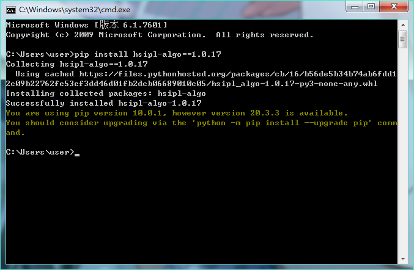
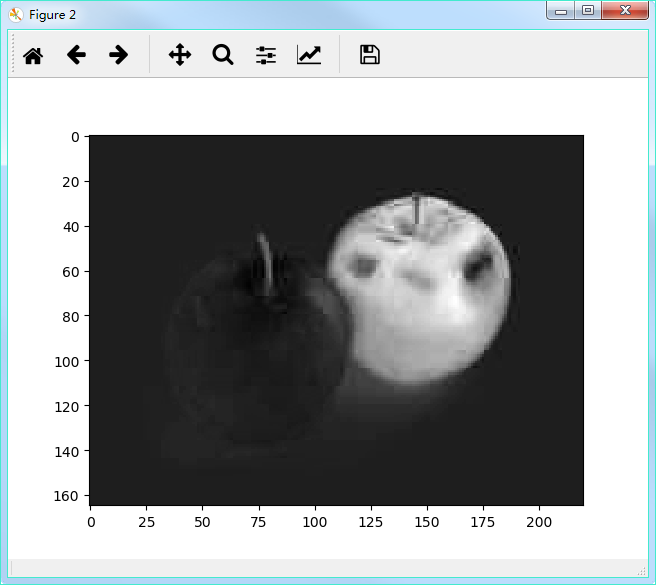

# Algorithm Package

這是一個由WEN所開發/整合而成的演算法套件，演算法主要適用於高光譜影像，包括影像前處理與背景抑制演算法，取得方式可以透過 cmd 輸入指令 pip install hsipl-algo 取得



演算法分類如下：
* 影像前處理演算法
	* 端元選擇
		* 像素點純度指數(PPI)
		* 自動目標點生成程序(ATGP)
		* 單純形增長算法(SGA)
		* N-FINDR
	* 估計波段選擇數
		* HFC
		* NWHFC
	* 波段選擇
		* 基於CEM-波段選擇
			* CEM-BCC
			* CEM-BCM
			* CEM-BDM
		* 基於相關係數-波段選擇
			* 相關係數-波段選擇(BS-Corrcoef)
		* 基於熵-波段選擇
			* 熵-波段選擇(BS-Entropy)
		* 基於標準差-波段選擇
			* 標準差-波段選擇(BS-STD)
		* 基於約束目標-波段選擇
			* 最小方差-波段優先級
				* MinV-BP
				* FminV-BP
			* 最大方差-波段優先級
				* MaxV-BP
				* BmaxV-BP
			* 循序前向約束目標-波段選擇
				* SF-CTBS
				* SF_TCIMBS
			* 循序後向約束目標-波段選擇
				* SB-CTBS
				* SB-TCIMBS
		* 基於融合波段約束目標-波段選擇
			* 融合波段最小方差-波段優先級(BS-MinV-BP)
			* 融合波段最大方差-波段優先級(BS-MaxV-BP)
			* 融合波段循序前向約束目標-波段選擇(BS-SF-CTBS)
			* 融合波段循序後向約束目標-波段選擇(BS-SB-CTBS)
		* 基於均勻分配-波段選擇
			* 均勻分配-波段選擇(uniform-BS)
		* 基於成分分析法-波段選擇
			* 主成分分析法-波段選擇(PCA-BS)
			* 獨立成分分析法-波段選擇(ICA-BS)
	* 影像分解
		* RPCA-分解法
			* RPCA-Kernel
				* GA-Kernel
				* GM-Kernel
				* Godec-Kernel
				* GreGoDec-Kernel
				* OPRMF-Kernel
				* PCP-Kernel
				* PRMF-Kernel
				* SSGoDec-Kernel
				* SVT-Kernel
				* TGA-Kernel
				
* 背景抑制演算法
	* 目標檢測演算法
		* 非權重式檢測演算法
			* 自相關矩陣
				* 最小能量限制法(CEM)
				* 子分割-最小能量限制法(Subset-CEM)
				* 滑動視窗-最小能量限制法(SW-CEM)
				* 自適應滑動視窗-最小能量限制法(SW-CEM)
				* 目標限制干擾最小化濾波器(TCIMF)
				* 自相關濾波器-自適應一致估計法(R-ACE)
				* 自相關濾波器-馬哈拉諾比斯距離(RMD)
				* 自相關濾波器-基於距離之匹配濾波器(RMFD)
			* 共變異數矩陣
				* 匹配濾波器(MF)
				* 自適應匹配濾波器(AMF)
				* 光譜匹配濾波器(AMF)
				* 共變異數-自適應一致估計法(K-ACE)
				* 共變異數-馬哈拉諾比斯距離(KMD)
				* 共變異數-基於距離之匹配濾波器(KMFD)
			* 距離
				* 歐式距離(ED)
			* 光譜角度
				* 光譜角度匹配(SAM)
			* 光譜散度
				* 光譜資訊分散度(SID)
			* 子空間投影
				* 正交子空間投影(OSP)
				* 最小二乘-正交子空間投影(LSOSFP)
				* Kernel最小二乘-正交子空間投影(KLSOSP)
			* SID-SAM混和
				* SID-tan(SAM)
				* SID-sin(SAM)
			* 未分類
				* CBD
				* JMD
				* OPD
				* TD
				* 廣義相似比測試(GLRT)
		* 權重式檢測演算法
			* 權重式-背景抑制
				* 歐式距離-權重式最小能量限制法(ED-CEM)
				* 光譜資訊分散度-權重式最小能量限制法(SID-CEM)
			* 迭代權重式-背景抑制
				* 自相關矩陣
					* 分層抑制式-最小能量限制法(hCEM)
				* 共變異數矩陣
					* 分層抑制式-共變異數-自適應一致估計法(hACE)
					* 分層抑制式-共變異數-馬哈拉諾比斯距離(hKMD)
					* 分層抑制式-自適應匹配濾波器(hAMF)
	* 異常檢測演算法
		* 自相關矩陣
			* 自相關濾波器-Reed-Xiaoli檢測器(R-RXD)
			* 低概率目標檢測器(LPTD)
		* 共變異數矩陣
			* 共變異數-Reed-Xiaoli檢測器(K-RXD)
			* 匹配自相關濾波器-Reed-Xiaoli檢測器(M-RXD)
			* 正規化-RXD(N-RXD)
			* 統一目標檢測器(UTD)
			* 統一目標自相關濾波器-Reed-Xiaoli檢測器(UTD-RXD)


```python
import numpy as np
import matplotlib.pyplot as plt
import hsipl_algo.Target_Algorithm as hTA

data = plt.imread('apple.jpg')

plt.figure()
plt.imshow(data)
plt.show()

data = np.double(data)

x, y, z = data.shape

d = data[70, 150, :].reshape(z, 1)

result = hTA.CEM(data, d)

plt.figure()
plt.imshow(result, cmap='gray')
plt.show()
```



[WEN-Github](https://github.com/luckywilliam111/hsipl_algo.git)