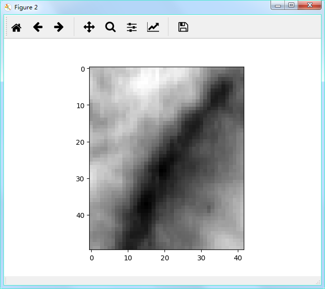
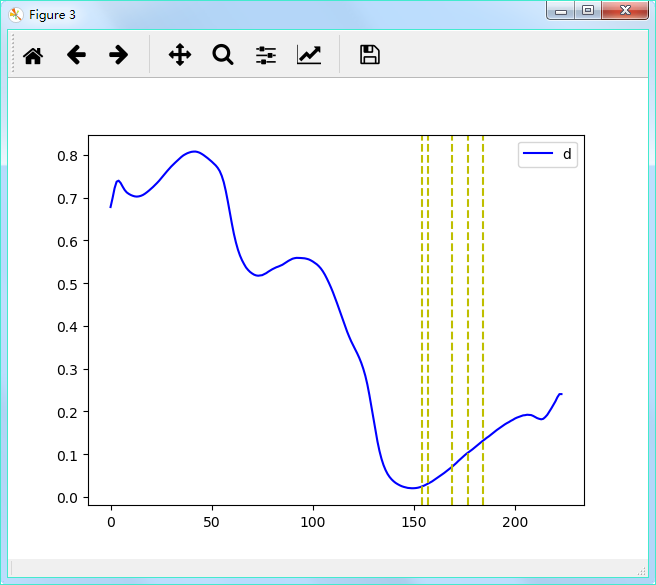
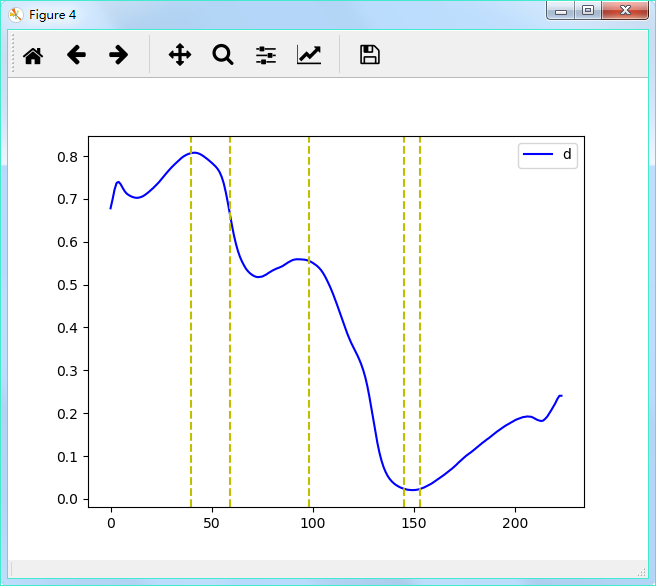
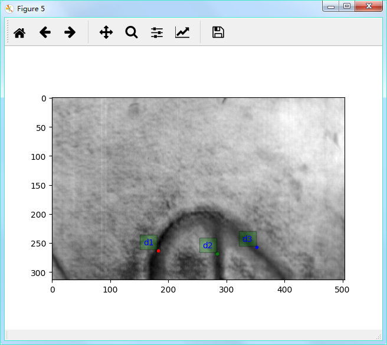
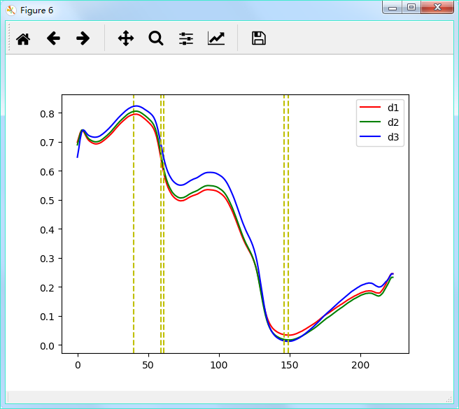
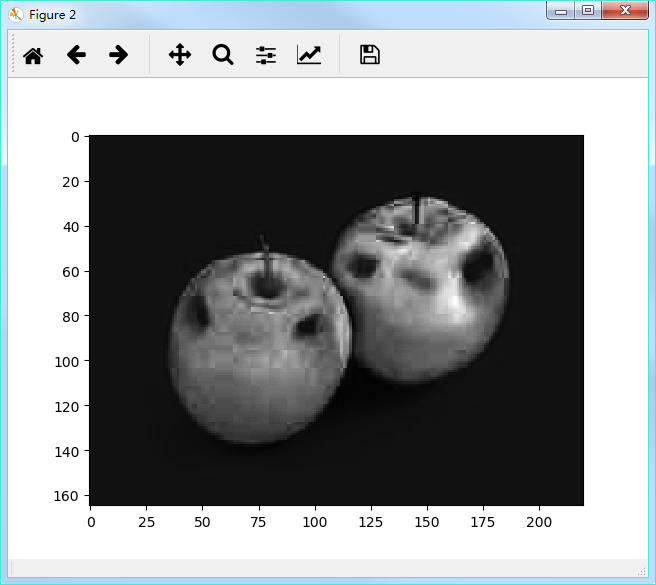

# Algorithm Package

<p style="text-align : center">這是一個由WEN所開發/整合而成的演算法套件，演算法主要適用於高光譜影像，包括影像前處理與背景抑制演算法，取得方式可以透過 cmd 輸入指令 pip install hsipl-algo==[version] 以取得最新版本套件</p>


# 資料夾階層

```
hsipl-algo
|---- build
|  |---- bdist.win-amd64
|  |---- lib
|     |---- hsipl_algo
|       |---- Anomaly_Algorithm.py
|       |---- Calc_Band.py
|       |---- CEM_BS_Method.py
|       |---- CT_BS_Method.py
|       |---- Find_EndMember.py
|       |---- get_Threshold.py
|       |---- Hierarchical_Algorithm.py
|       |---- Other_BS_Method.py
|       |---- RPCA_Decomposition.py
|       |---- Target_Algorithm.py
|       |---- Weighted_Target_Algorithm.py
|
|---- dist
|  |---- hsipl_algo-1.0.22.tar
|  |---- hsipl_algo-1.0.22-py3-none-any.whl
|
|---- hsipl_algo
|  |---- Anomaly_Algorithm.py
|  |---- Calc_Band.py
|  |---- CEM_BS_Method.py
|  |---- CT_BS_Method.py
|  |---- Find_EndMember.py
|  |---- get_Threshold.py
|  |---- Hierarchical_Algorithm.py
|  |---- Other_BS_Method.py
|  |---- RPCA_Decomposition.py
|  |---- Target_Algorithm.py
|  |---- Weighted_Target_Algorithm.py
|
|---- hsipl_algo.egg-info
|  |---- dependency_links.txt
|  |---- PKG-INFO
|  |---- SOURCES.txt
|  |---- top_level.txt
|
|---- image
|  |---- install.png
|  |---- apple.jpg
|  |---- GA_Low_Rank_Matrix.png
|  |---- GA_Sparse_Matrix.png
|  |---- Target_Detection.png
|  |---- Anomaly_Detection.png
|  |---- Leather_Image.jpg
|  |---- PPI_EndMember.png
|  |---- N_FINDR_EndMember.png
|  |---- Leather_ROI_Image.png
|  |---- Leather_CEM_Band_Selection.png
|  |---- Leather_Fusion_Band_Selelction_Target.png
|  |---- Leather_Fusion_SF_CTBS_Band_Selelction.png
|
|---- .gitattributes
|---- LICENSE
|---- README.md
|---- setup.py
```
# 演算法分類

* 影像前處理演算法
	* 端元選擇
		* 像素點純度指數(PPI)
		* 自動目標點生成程序(ATGP)
		* 單純形增長算法(SGA)
		* N-FINDR
	* 估計波段選擇數
		* HFC
		* NWHFC
	* 波段選擇
		* 基於CEM-波段選擇
			* 最小能量限制法之波段關聯限制(CEM-BCC)
			* 最小能量限制法之波段關聯(CEM-BCM)
			* 最小能量限制法之波段依賴最小化(CEM-BDM)
		* 基於相關係數-波段選擇
			* 相關係數-波段選擇(BS-Corrcoef)
		* 基於熵-波段選擇
			* 熵-波段選擇(BS-Entropy)
		* 基於標準差-波段選擇
			* 標準差-波段選擇(BS-STD)
		* 基於約束目標-波段選擇
			* 最小方差-波段優先級
				* MinV-BP
				* FminV-BP
			* 最大方差-波段優先級
				* MaxV-BP
				* BmaxV-BP
			* 循序前向約束目標-波段選擇
				* SF-CTBS
				* SF_TCIMBS
			* 循序後向約束目標-波段選擇
				* SB-CTBS
				* SB-TCIMBS
		* 基於融合波段約束目標-波段選擇
			* 融合波段最小方差-波段優先級(BS-MinV-BP)
			* 融合波段最大方差-波段優先級(BS-MaxV-BP)
			* 融合波段循序前向約束目標-波段選擇(BS-SF-CTBS)
			* 融合波段循序後向約束目標-波段選擇(BS-SB-CTBS)
		* 基於均勻分配-波段選擇
			* 均勻分配-波段選擇(uniform-BS)
		* 基於成分分析法-波段選擇
			* 主成分分析法-波段選擇(PCA-BS)
			* 獨立成分分析法-波段選擇(ICA-BS)
	* 影像分解
		* Robust-PCA-分解法
			* Robust-PCA-Kernel
				* GA-Kernel
				* GM-Kernel
				* Godec-Kernel
				* GreGoDec-Kernel
				* OPRMF-Kernel
				* PCP-Kernel
				* PRMF-Kernel
				* SSGoDec-Kernel
				* SVT-Kernel
				* TGA-Kernel
				
* 背景抑制演算法
	* 目標檢測演算法
		* 非權重式檢測演算法
			* 自相關矩陣
				* 最小能量限制法(CEM)
				* 子分割-最小能量限制法(Subset-CEM)
				* 滑動視窗-最小能量限制法(SW-CEM)
				* 自適應滑動視窗-最小能量限制法(SW-CEM)
				* 目標限制干擾最小化濾波器(TCIMF)
				* 自相關濾波器-自適應一致估計法(R-ACE)
				* 自相關濾波器-馬哈拉諾比斯距離(RMD)
				* 自相關濾波器-基於距離之匹配濾波器(RMFD)
			* 共變異數矩陣
				* 匹配濾波器(MF)
				* 自適應匹配濾波器(AMF)
				* 光譜匹配濾波器(AMF)
				* 共變異數-自適應一致估計法(K-ACE)
				* 共變異數-馬哈拉諾比斯距離(KMD)
				* 共變異數-基於距離之匹配濾波器(KMFD)
			* 距離
				* 歐式距離(ED)
			* 光譜角度
				* 光譜角度匹配(SAM)
			* 光譜散度
				* 光譜資訊分散度(SID)
			* 子空間投影
				* 正交子空間投影(OSP)
				* 最小二乘-正交子空間投影(LSOSFP)
				* Kernel最小二乘-正交子空間投影(KLSOSP)
			* SID-SAM混和
				* SID-tan(SAM)
				* SID-sin(SAM)
			* 未分類
				* CBD
				* JMD
				* OPD
				* TD
				* 廣義相似比測試(GLRT)
		* 權重式檢測演算法
			* 權重式-背景抑制
				* 歐式距離-權重式最小能量限制法(ED-CEM)
				* 光譜資訊分散度-權重式最小能量限制法(SID-CEM)
			* 迭代權重式-背景抑制
				* 自相關矩陣
					* 分層抑制式-最小能量限制法(hCEM)
				* 共變異數矩陣
					* 分層抑制式-共變異數-自適應一致估計法(hACE)
					* 分層抑制式-共變異數-馬哈拉諾比斯距離(hKMD)
					* 分層抑制式-自適應匹配濾波器(hAMF)
	* 異常檢測演算法
		* 自相關矩陣
			* 自相關濾波器-Reed-Xiaoli檢測器(R-RXD)
			* 滑動視窗-Reed-Xiaoli檢測器((SW-RXD)
			* 低概率目標檢測器(LPTD)
		* 共變異數矩陣
			* 共變異數-Reed-Xiaoli檢測器(K-RXD)
			* 匹配自相關濾波器-Reed-Xiaoli檢測器(M-RXD)
			* 正規化-RXD(N-RXD)
			* 統一目標檢測器(UTD)
			* 統一目標自相關濾波器-Reed-Xiaoli檢測器(UTD-RXD)

# Robust PCA Decomposition Example Code

```python
import numpy as np
import matplotlib.pyplot as plt
import hsipl_algo.RPCA_Decomposition as hRD

data = plt.imread('apple.jpg')

plt.figure()
plt.imshow(data)
plt.show()

data = np.double(data)

x, y, z = data.shape

re_data = data.reshape(x * y, z)

L, S = hRD.GA(re_data)

L = L.reshape(x, y, z)

S = S.reshape(x, y, z)

plt.figure()
plt.imshow(L / 255)
plt.show()

plt.figure()
plt.imshow(S / 255)
plt.show()
```


# Find End-Member Example Code

```python
import numpy as np
import scipy.io as sio
import matplotlib.pyplot as plt
import hsipl_algo.Find_EndMember as hFE

data = sio.loadmat('A_6_mnf.mat')
data = data['im_mnf']

data = np.double(data)

bs = sio.loadmat('A_6_CEM_SF_CTBS_band_select_result.mat')
bs = (bs['SF_CTBS_band_select_result']).transpose()
bs = bs.reshape(bs.shape[0])

bs_data = data[:, :, bs]

plt.figure()
plt.imshow(data[:, :, 100], cmap='gray')
plt.show()

x, y, z = data.shape

xx, yy, score, result = hFE.PPI(bs_data, 1500)

score = score.reshape(x, y)

coordinate = []

plt.figure()
plt.imshow(data[:, :, 100], cmap='gray')
for i in range(5):
    ppi_score = xx[0, -1-i]
    x_y = np.argwhere(score == ppi_score)
    
    try:
        for j in range(x_y.shape[0]):
            coordinate.append([ppi_score, x_y[j, 0], x_y[j, 1]])
            plt.plot(np.int(x_y[j, 1]), np.int(x_y[j, 0]), '.r')
            plt.text(np.int(x_y[j, 1])-7, np.int(x_y[j, 0])-7, 'PPI Score= ' + str(np.int(ppi_score)), fontsize=10, color='blue', horizontalalignment='right', verticalalignment='bottom', bbox=dict(facecolor='green', alpha=0.3))
    except Exception:
        pass
    
plt.show()

endmemberindex = hFE.N_FINDR(bs_data, 4)

plt.figure()
plt.imshow(data[:, :, 100], cmap='gray')
for i in range(endmemberindex.shape[0]):
    plt.plot(np.int(endmemberindex[i, 0]), np.int(endmemberindex[i, 1]), '.r')
    plt.text(np.int(endmemberindex[i, 0])-7, np.int(endmemberindex[i, 1])-7, 'N-FINDR EndMember= ' + str(np.int(i+1)), fontsize=10, color='blue', horizontalalignment='right', verticalalignment='bottom', bbox=dict(facecolor='green', alpha=0.3))
plt.show()
```


# CEM / CTBS / Fusion-CTBS Band-Selection Example Code

```python
import numpy as np
import scipy.io as sio
import matplotlib.pyplot as plt
import hsipl_algo.CEM_BS_Method as hCM
import hsipl_algo.CT_BS_Method as hCBM

data = sio.loadmat('A_6_mnf.mat')
data = data['im_mnf']

d = sio.loadmat('A_6_d.mat')
d = d['d']

coordinate = sio.loadmat('A_6_coordinate.mat')
coordinate = coordinate['coordinate']

data = np.double(data)

x, y, z = data.shape

plt.figure()
plt.imshow(data[:, :, 100], cmap='gray')
plt.show()

data_roi = data[213:263, 170:212, :]

plt.figure()
plt.imshow(data_roi[:, :, 100], cmap='gray')
plt.show()

bs_cem = hCM.CEM_BDM(data_roi[:, :, 30:200], 5)
bs_cem = bs_cem + 30

plt.figure()
plt.plot(d, 'b', label='d')
for i in range(bs_cem.shape[0]):
    plt.axvline(x = bs_cem[i], color='y', linestyle='--')
plt.legend()
plt.show()

bs_ctbs = hCBM.SF_CTBS(data[:, :, 30:200], d[30:200], 5)
bs_ctbs = bs_ctbs + 30

plt.figure()
plt.plot(d, 'b', label='d')
for i in range(bs_ctbs.shape[0]):
    plt.axvline(x = bs_ctbs[i], color='y', linestyle='--')
plt.legend()
plt.show()

d1 = data[coordinate[0, 1], coordinate[0, 0], :].reshape(z, 1)
d2 = data[coordinate[1, 1], coordinate[1, 0], :].reshape(z, 1)
d3 = data[coordinate[2, 1], coordinate[2, 0], :].reshape(z, 1)

plt.figure()
plt.imshow(data[:, :, 100], cmap='gray')
plt.plot(coordinate[0, 0], coordinate[0, 1], '.r')
plt.text(coordinate[0, 0]-7, coordinate[0, 1]-7, 'd1', fontsize=10, color='blue', horizontalalignment='right', verticalalignment='bottom', bbox=dict(facecolor='green', alpha=0.3))
plt.plot(coordinate[1, 0], coordinate[1, 1], '.g')
plt.text(coordinate[1, 0]-7, coordinate[1, 1]-7, 'd2', fontsize=10, color='blue', horizontalalignment='right', verticalalignment='bottom', bbox=dict(facecolor='green', alpha=0.3))
plt.plot(coordinate[2, 0], coordinate[2, 1], '.b')
plt.text(coordinate[2, 0]-7, coordinate[2, 1]-7, 'd3', fontsize=10, color='blue', horizontalalignment='right', verticalalignment='bottom', bbox=dict(facecolor='green', alpha=0.3))
plt.show()

d = np.hstack([d1, d2, d3])

bs_fusion_ctbs = hCBM.BS_SF_CTBS(data[:, :, 30:200], d[30:200, :], 5)
bs_fusion_ctbs = bs_fusion_ctbs + 30

color = ['red', 'green', 'blue']

plt.figure()
for i in range(bs_fusion_ctbs.shape[0]):
    if i < d.shape[1]:
        plt.plot(d[:, i], color=color[i], label='d' + str(i+1))
    plt.axvline(x = bs_fusion_ctbs[i], color='y', linestyle='--')
plt.legend()
plt.show()
```




# CNN Feature Entropy / Variance Band-Selection Example Code

```python
import numpy as np
import scipy.io as sio
from scipy.stats import entropy
import matplotlib.pyplot as plt
from keras import backend as K
from keras.models import Sequential
from keras.layers import Activation, Flatten, Conv2D, MaxPooling2D, BatchNormalization

def CNN_Featur_Model(filters, kernel, input_shape, activation, pad, maxpool, model_type='vgg', active=True, BNormalize=True, MaxPool=True, summary=True):
    model = Sequential()
    
    if model_type == 'vgg':
        for i in range(len(filters)):
            if i == 0:
                model.add(Conv2D(filters[i], (kernel[i], kernel[i]), padding=pad[i], input_shape=input_shape))
            elif i > 0:
                model.add(Conv2D(filters[i], (kernel[i], kernel[i]), padding=pad[i]))
                
            if active == True:
                model.add(Activation(activation[i]))
                
            if BNormalize == True:
                model.add(BatchNormalization())
                
            if MaxPool == True and i > 0 and (i%2 == 1):
                model.add(MaxPooling2D(pool_size=(maxpool[np.int(i/2)], maxpool[np.int(i/2)])))
                
    elif model_type == 'self':
        if len(filters) and len(kernel) and len(activation):
            for i in range(len(filters)):
                if i == 0:
                    model.add(Conv2D(filters[i], (kernel[i], kernel[i]), padding=pad[i], input_shape=input_shape))
                elif i > 0:
                    model.add(Conv2D(filters[i], (kernel[i], kernel[i]), padding=pad[i]))
                
                if active == True:
                    model.add(Activation(activation[i]))
                    
                if BNormalize == True:
                    model.add(BatchNormalization())
                    
                if MaxPool == True:
                    model.add(MaxPooling2D(pool_size=(maxpool[i], maxpool[i])))
                    
    model.add(Flatten())
    
    if summary == True:
        model.summary()
        
    return model

def CNN_Entropy_Band_Selection(HIM, model, num):
    x, y, z = HIM.shape

    X = HIM.reshape(z, x, y, 1)
    
    feature_maps = model.predict(X)
    
    band_entropy = np.zeros([z])
    
    for i in range(z):
        band_entropy[i] = entropy(feature_maps[i, :])
        
    band_select_entropy = np.argsort(band_entropy * -1)
    
    band_select_entropy = band_select_entropy[:num]
    
    return band_select_entropy

def CNN_Variance_Band_Selection(HIM, model, num):
    x, y, z = HIM.shape

    X = HIM.reshape(z, x, y, 1)
    
    feature_maps = model.predict(X)
    
    band_variance = np.zeros([z])
    
    for i in range(z):
        band_variance[i] = np.var(feature_maps[i, :])
        
    band_select_variance = np.argsort(band_variance * -1)
    
    band_select_variance = band_select_variance[:num]
    
    return band_select_variance

#================================ Load Data ===================================

path = 'data1/'

data = sio.loadmat(path + 'A_6_mnf.mat')
data = data['im_mnf']

d = sio.loadmat(path + 'A_6_d.mat')
d = d['d']

HIM = data[:, :, 30:200]

x, y, z = HIM.shape

re_HIM = HIM.reshape(z, x, y, 1)

num_band = 5

#==============================================================================

#======================= Create VGG-Type Convolution Model ====================

filters=[16, 16, 8, 8]
kernel = [3, 3, 3, 3]
input_shape = (re_HIM.shape[1], re_HIM.shape[2], re_HIM.shape[3])
pad = ['same', 'same', 'same', 'same']
activation = ['relu', 'relu', 'relu', 'relu']
maxpool = [2, 2]

model_vgg = CNN_Featur_Model(filters, kernel, input_shape, activation, pad, maxpool, model_type='vgg')

#====================== Get VGG-Type Feature Map Get Band =====================

band_select_entropy_vgg = CNN_Entropy_Band_Selection(HIM, model_vgg, num_band)
band_select_entropy_vgg = band_select_entropy_vgg + 30

band_select_variance_vgg = CNN_Variance_Band_Selection(HIM, model_vgg, num_band)
band_select_variance_vgg = band_select_variance_vgg + 30

#==============================================================================

#============================== Clear Keras Model =============================

K.clear_session()

#==============================================================================

print('\n\n')

#====================== Create Self-Type Convolution Model ====================

filters=[16, 8]
kernel = [3, 3]
input_shape = (re_HIM.shape[1], re_HIM.shape[2], re_HIM.shape[3])
pad = ['same', 'same']
activation = ['relu', 'relu']
maxpool = [2, 2]

model_self = CNN_Featur_Model(filters, kernel, input_shape, activation, pad, maxpool, model_type='self')

#==============================================================================

#===================== Get Self-Type Feature Map Get Band =====================

band_select_entropy_self = CNN_Entropy_Band_Selection(HIM, model_self, num_band)
band_select_entropy_self = band_select_entropy_self + 30

band_select_variance_self = CNN_Variance_Band_Selection(HIM, model_self, num_band)
band_select_variance_self = band_select_variance_self + 30

#==============================================================================

#================================= Plot Band ==================================

plt.figure()
plt.plot(d, 'r')
for i in range(num_band):
    plt.axvline(x=band_select_entropy_vgg[i], color='yellow')
    
plt.show()

plt.figure()
plt.plot(d, 'r')
for i in range(num_band):
    plt.axvline(x=band_select_variance_vgg[i], color='yellow')
    
plt.show()

plt.figure()
plt.plot(d, 'r')
for i in range(num_band):
    plt.axvline(x=band_select_entropy_self[i], color='yellow')
    
plt.show()

plt.figure()
plt.plot(d, 'r')
for i in range(num_band):
    plt.axvline(x=band_select_variance_self[i], color='yellow')
    
plt.show()

#==============================================================================
```

VGG-Type CNN Model


Self-Type CNN Model


# Target / Anomaly Detection Example Code

```python
import numpy as np
import matplotlib.pyplot as plt
import hsipl_algo.Target_Algorithm as hTA
import hsipl_algo.Anomaly_Algorithm as hAA

data = plt.imread('apple.jpg')

plt.figure()
plt.imshow(data)
plt.show()

data = np.double(data)

x, y, z = data.shape

d = data[70, 150, :].reshape(z, 1)

result = hTA.CEM(data, d)

plt.figure()
plt.imshow(result, cmap='gray')
plt.show()

result = hAA.R_RXD(data)

plt.figure()
plt.imshow(result, cmap='gray')
plt.show()
```



[WEN-Github](https://github.com/luckywilliam111/hsipl_algo.git)